# System Architecture

## High-Level Architecture

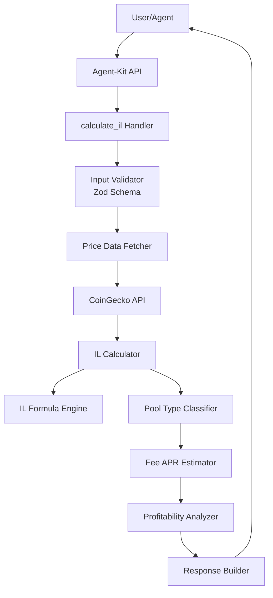

## Data Flow

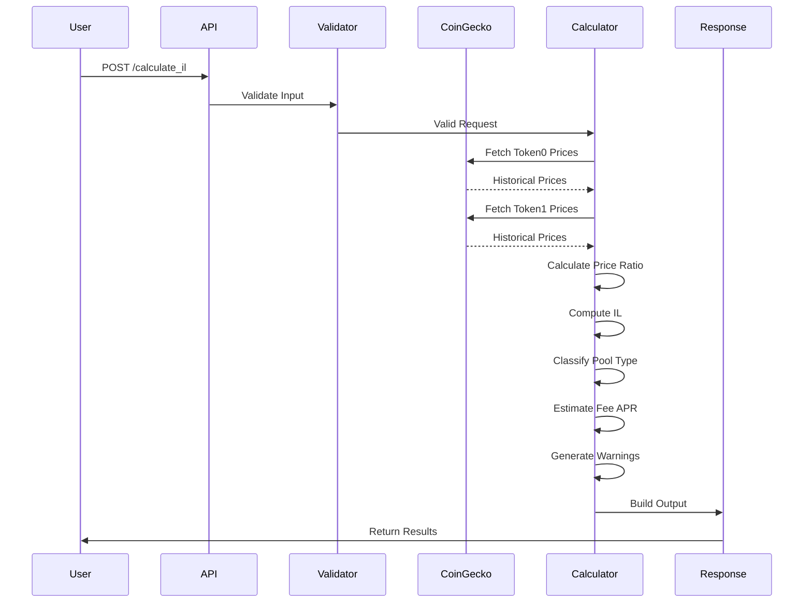

## Component Architecture

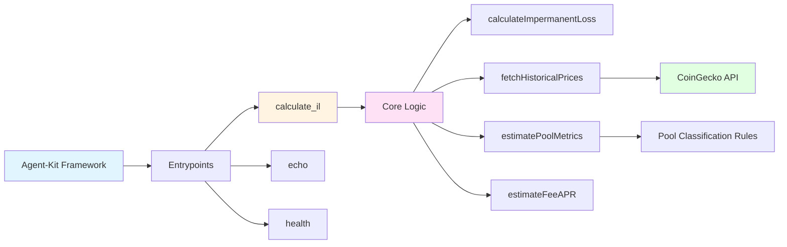

## IL Calculation Flow

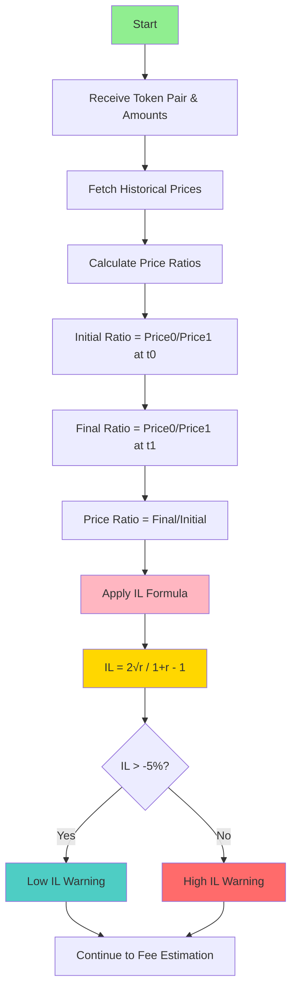

## Pool Type Classification

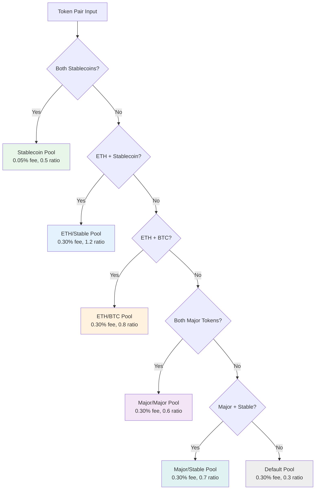

## Fee APR Calculation

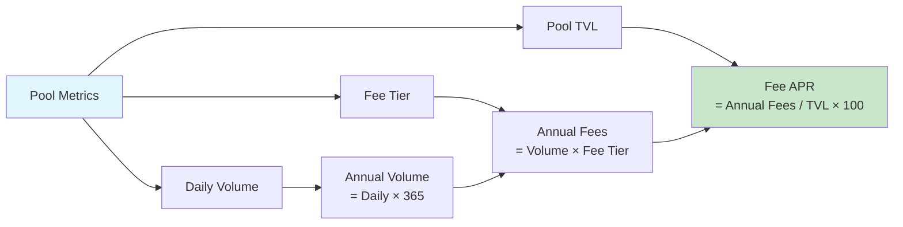

## Profitability Analysis

```mermaid
flowchart TD
    A[Calculate IL] --> B[Annualize IL<br/>IL × 365/days]
    C[Calculate Fee APR] --> D[Compare]
    B --> D
    D --> E{Fee APR > |IL|?}
    E -->|Yes| F[✅ Profitable Position<br/>Net APR = Fee APR + IL]
    E -->|No| G[⚠️ Losing Position<br/>IL exceeds fees]
    
    F --> H[Generate Positive Notes]
    G --> I[Generate Warning Notes]
    
    H --> J[Return Results]
    I --> J
    
    style F fill:#4CAF50
    style G fill:#FF5252
    style J fill:#2196F3
```

## System Boundaries

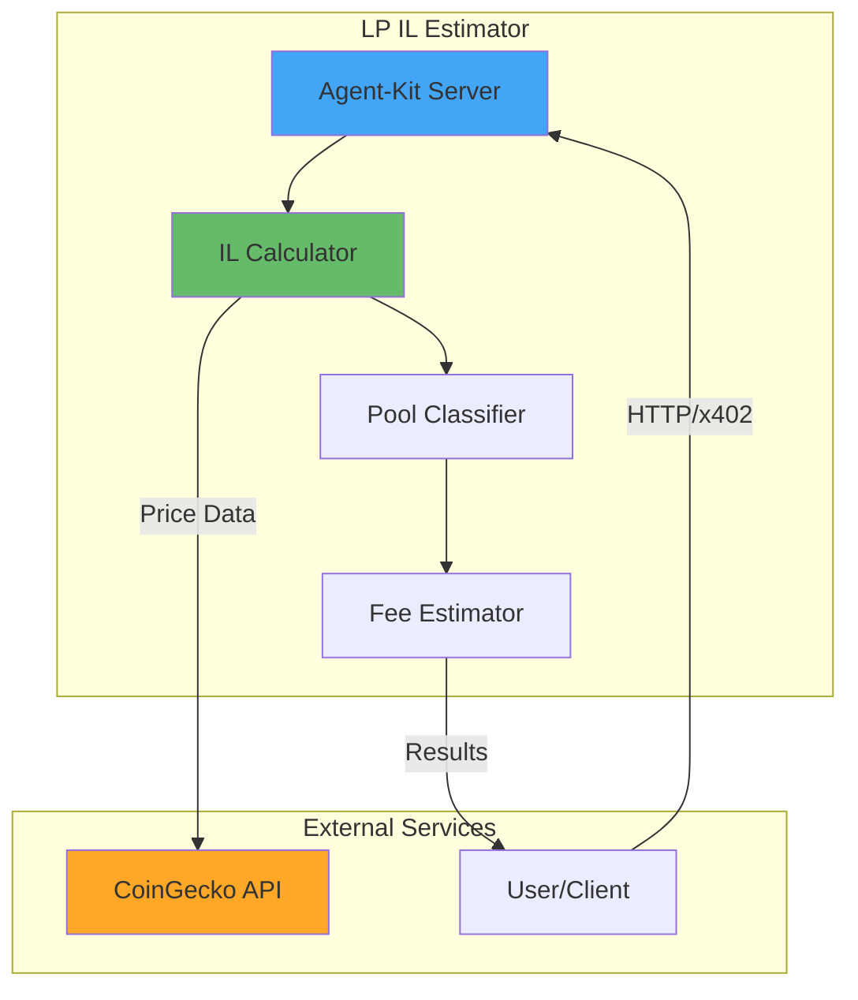

## Deployment Architecture (Example: Vercel)

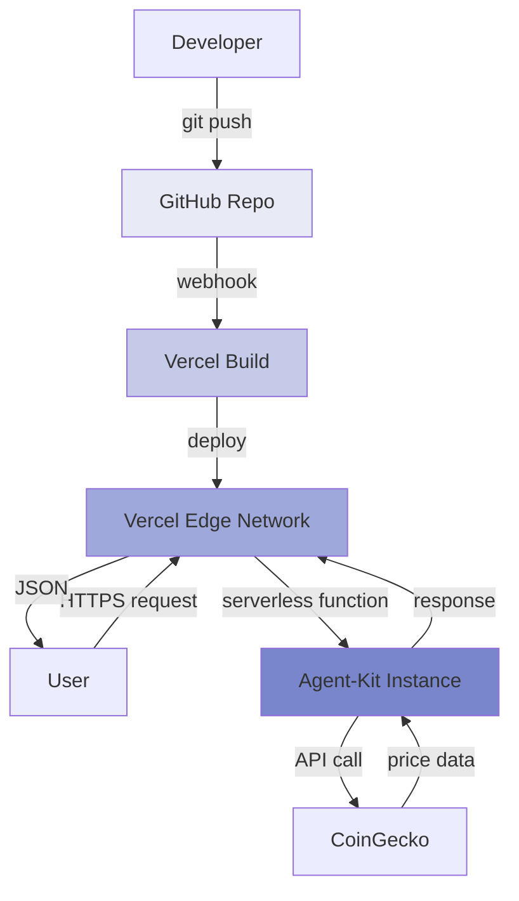

## Error Handling Flow

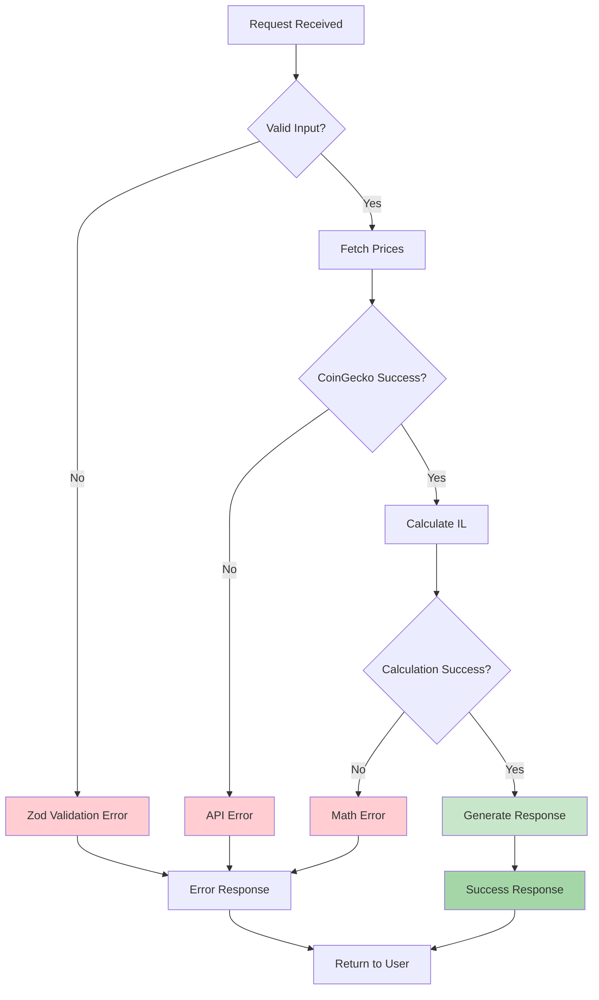

## Data Model

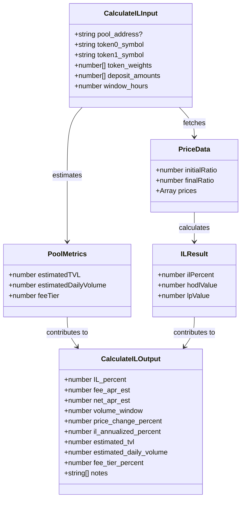

## State Diagram

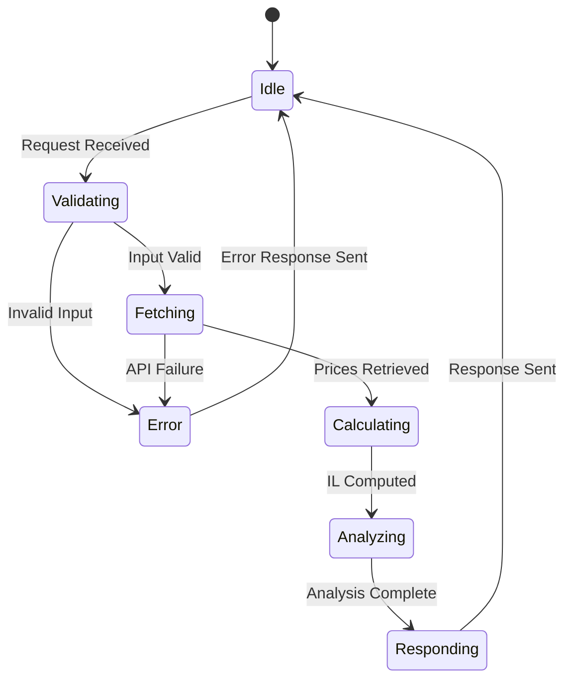

## Technology Stack

```mermaid
graph TB
    A[LP IL Estimator] --> B[Runtime Layer]
    A --> C[Framework Layer]
    A --> D[Data Layer]
    A --> E[Protocol Layer]
    
    B --> B1[Node.js 18+]
    B --> B2[TypeScript 5.3]
    
    C --> C1[@lucid-dreams/agent-kit]
    C --> C2[Zod Validation]
    
    D --> D1[CoinGecko API]
    D --> D2[In-Memory Cache]
    
    E --> E1[HTTP/HTTPS]
    E --> E2[x402 Protocol]
    
    style A fill:#1976D2
    style B fill:#388E3C
    style C fill:#F57C00
    style D fill:#7B1FA2
    style E fill:#C2185B
```

---

## Key Design Decisions

### 1. **Pure Calculation Engine**
No database required - stateless design makes it easy to scale and deploy anywhere.

### 2. **Intelligent Heuristics**
Pool classification uses token pair analysis to estimate realistic volumes and fees without on-chain data.

### 3. **Real Price Data**
CoinGecko integration ensures calculations reflect actual market conditions, not simulated data.

### 4. **Conservative Estimates**
Volume and TVL estimates are conservative to avoid overpromising returns.

### 5. **Comprehensive Output**
Returns not just IL, but net profitability, warnings, and actionable insights.

### 6. **Error Resilience**
Graceful degradation - returns partial results even if some data is unavailable.

---

## Performance Characteristics

- **Average Response Time**: 1-3 seconds (dominated by CoinGecko API)
- **Memory Usage**: <50MB per instance
- **Concurrent Requests**: Limited by CoinGecko rate limits (10-50/min)
- **Scalability**: Stateless design enables horizontal scaling

---

## Future Architecture Considerations

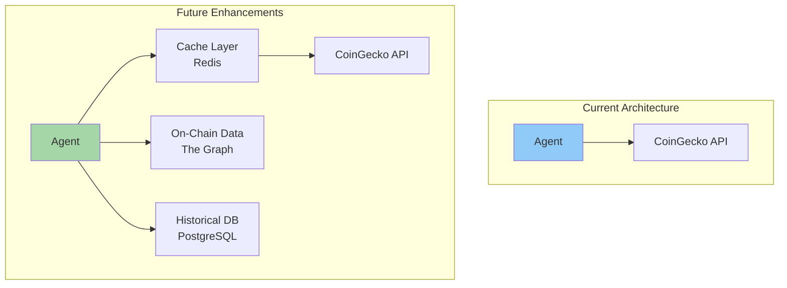

**Potential Improvements:**
- Redis caching for frequently requested pairs
- The Graph for real-time on-chain data
- PostgreSQL for historical calculations
- WebSocket updates for live positions
- Concentrated liquidity support (Uniswap V3)
